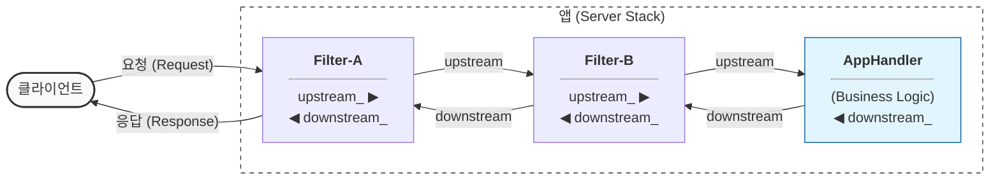

# Proxygen 요청 처리 구조

---

## 의존 라이브러리 레이어

proxygen은 단독으로 동작하지 않고 Meta의 세 라이브러리 위에 쌓인 구조입니다.

```mermaid
flowchart TD
    %% 노드 정의
    proxygen["<b>proxygen</b><br/>HTTP/1.1 · HTTP/2 · HTTP/3 프로토콜 처리<br/>RequestHandler · Filter · HTTPServer"]
    
    wangle["<b>wangle</b><br/>연결 수락 · 파이프라인 · 코덱 추상화<br/>Acceptor · Pipeline · HandlerContext"]
    
    fizz["<b>fizz</b><br/>TLS 1.3 구현<br/>인증서 · 암호화 · 복호화<br/>0-RTT · ALPN 협상"]
    
    folly["<b>folly</b><br/>EventBase (이벤트 루프)<br/>IOBuf (제로카피 버퍼)<br/>Future/Promise<br/>ThreadPoolExecutor"]

    %% 연결 관계 및 설명
    proxygen -->|"연결·파이프라인 관리 위임"| wangle
    wangle -->|"TLS 핸드셰이크 위임"| fizz
    wangle -->|"이벤트 루프·버퍼 사용"| folly

    %% 스타일링
    style proxygen fill:#fff,stroke:#333,stroke-width:1px
    style wangle fill:#fff,stroke:#333,stroke-width:1px
    style fizz fill:#fff,stroke:#333,stroke-width:1px
    style folly fill:#fff,stroke:#333,stroke-width:1px
```



### 각 라이브러리 역할

| 라이브러리 | 담당 레이어 | 핵심 역할 |
|-----------|------------|-----------|
| **folly** | 기반 유틸리티 | 비동기 I/O의 근간. `EventBase`로 이벤트 루프를 구동하고 `IOBuf`로 데이터를 복사 없이 다룸 |
| **fizz** | TLS 레이어 | TLS 1.3 구현체. HTTPS 연결의 핸드셰이크·암호화·복호화를 전담 |
| **wangle** | 네트워크 파이프라인 | TCP 연결 수락 후 데이터를 코덱·핸들러 파이프라인으로 분배. proxygen의 HTTP 파싱 코덱이 여기에 등록됨 |
| **proxygen** | HTTP 애플리케이션 | HTTP 프로토콜 파싱·라우팅·필터·핸들러 인터페이스 제공. 애플리케이션 코드가 직접 다루는 레이어 |

### 요청 하나가 스택을 타고 올라오는 흐름

```
  네트워크 패킷 수신
        │
        ▼
  folly::EventBase       이벤트 감지, 소켓 읽기
        │
        ▼
  fizz                   TLS 복호화 (HTTPS인 경우)
        │
        ▼
  wangle Pipeline        HTTP 바이트 스트림 → HTTPMessage 파싱
        │
        ▼
  proxygen               Filter 체인 → AppHandler → 응답 전송
```

---

## 전체 구조

```
                         ┌─────────────────────────────────────────┐
                         │             HTTPServer                  │
                         │  (I/O 스레드 풀, 포트 바인딩)           │
                         └────────────────┬────────────────────────┘
                                          │ 연결 수락
                                          ▼
                         ┌─────────────────────────────────────────┐
                         │             HTTPSession                 │
                         │  (TCP 연결 하나 = 세션 하나)            │
                         └────────────────┬────────────────────────┘
                                          │ 요청 수신
                                          ▼
                         ┌─────────────────────────────────────────┐
                         │           HTTPTransaction               │
                         │  (요청/응답 한 쌍 = 트랜잭션 하나)      │
                         └────────────────┬────────────────────────┘
                                          │ onRequest()
                                          ▼
                         ┌─────────────────────────────────────────┐
                         │      RequestHandlerFactory              │
                         │  (요청마다 필터+핸들러 체인 조립)       │
                         └────────────────┬────────────────────────┘
                                          │
                          ┌───────────────┼───────────────┐
                          ▼               ▼               ▼
                       Filter-A       Filter-B       AppHandler
```

---

## 필터 체인

### 체인 구조



- **upstream_**: 다음 핸들러를 가리키는 포인터 (요청 방향 →)
- **downstream_**: 이전 핸들러를 가리키는 포인터 (응답 방향 ←)
- Filter는 두 포인터를 모두 가지며 요청·응답 양방향을 가로챌 수 있음
- AppHandler는 `downstream_`만 가짐 (응답 전송용)

### 요청 흐름 (→)

```
HTTPTransaction
    │
    ▼
Filter-A.onRequest()   →   Filter-B.onRequest()   →   AppHandler.onRequest()
Filter-A.onBody()      →   Filter-B.onBody()      →   AppHandler.onBody()
Filter-A.onEOM()       →   Filter-B.onEOM()       →   AppHandler.onEOM()
```

각 Filter는 `upstream_->onRequest()`를 호출해 다음으로 전달합니다.
필요하면 헤더를 수정하거나 전달을 차단할 수 있습니다.

### 응답 흐름 (←)

```
AppHandler.sendHeaders()   →   Filter-B.sendHeaders()   →   Filter-A.sendHeaders()   →   Client
AppHandler.sendBody()      →   Filter-B.sendBody()      →   Filter-A.sendBody()      →   Client
AppHandler.sendEOM()       →   Filter-B.sendEOM()       →   Filter-A.sendEOM()       →   Client
```

각 Filter는 `downstream_->sendHeaders()`를 호출해 클라이언트 방향으로 전달합니다.
필요하면 body를 압축하거나 헤더를 추가할 수 있습니다.

---

## 필터 체인 조립

`RequestHandlerFactory::onRequest()`는 요청마다 호출되며, 팩토리를 여러 개 등록하면 안쪽에서 바깥쪽 순서로 체인을 쌓습니다.

```
등록 순서:   [AppHandlerFactory] → [FilterBFactory] → [FilterAFactory]

조립 결과:

  FilterAFactory.onRequest( FilterB )
        │
        ▼
  FilterA( upstream_=FilterB )
        │
        └──► FilterBFactory.onRequest( AppHandler )
                    │
                    ▼
              FilterB( upstream_=AppHandler )
                    │
                    └──► AppHandlerFactory.onRequest()
                                │
                                ▼
                          AppHandler
```

최종적으로 가장 바깥쪽인 Filter-A가 HTTPTransaction에 연결됩니다.

---

## Filter 생명주기

```
요청 시작          요청 처리 중          요청 완료
    │                   │                   │
    ▼                   ▼                   ▼
new Filter()      onRequest()         requestComplete()
 (힙 할당)        onBody()             └─ delete this
                  onEOM()                 (자기 소멸)
```

Filter는 요청 단위로 생성되고 완료 후 스스로 소멸합니다.
요청 간에 공유할 상태는 Filter가 아닌 **Factory**에 보관합니다.

---

## 클래스 관계 요약

```
RequestHandler          ResponseHandler
(요청 수신 인터페이스)   (응답 송신 인터페이스)
        ▲                       ▲
        │         둘 다 구현     │
        └──────── Filter ────────┘
                     ▲
                     │ 상속
              ┌──────┴───────┐
           FilterA        FilterB

        RequestHandler
              ▲
              │ 상속
          AppHandler      ← downstream_만 가짐
```
